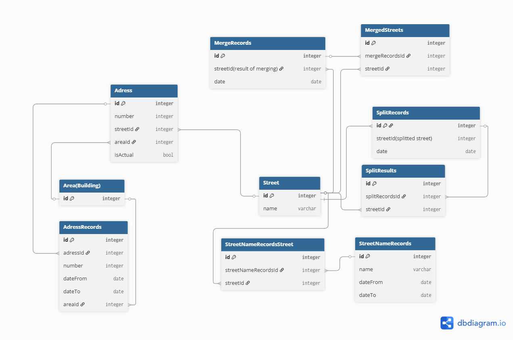

# Сутності
## Головні
- [Area(Building)](Entities/Area(Building))
- [Street](Entities/Street)
- [Adress](Entities/Adress)
## Допоміжні
- [MergeRecords](Entities/MergeRecords)
- [SplitRecords](Entities/SplitRecords)
- [AdressRecords](Entities/AdressRecords)
- [StreetNameRecords](Entities/StreetNameRecords)

```
// Use DBML to define your database structure

// Docs: https://dbml.dbdiagram.io/docs

  

Table "Area(Building)" {

  id integer [primary key]

}

  

Table Street {

  id integer [primary key]

  name varchar

}

  
  

Table Adress {

  id integer [primary key]

  number integer

  streetId integer

  areaId integer

  isActual bool

}

  

Table AdressRecords {

  id integer [primary key]

  adressId integer

  number integer

  dateFrom date

  dateTo date

  areaId integer

}

  

Table StreetNameRecords {

  id integer [primary key]

  name varchar

  dateFrom date

  dateTo date

}

  

Table StreetNameRecordsStreet {

  id integer [primary key]

  streetNameRecordsId integer

  streetId integer

}

  

Table MergeRecords {

  id integer [primary key]

  "streetId(result of merging)" integer

  "date" date

}

  

Table MergedStreets {

  id integer [primary key]

  mergeRecordsId integer

  streetId integer

}

  

Table SplitRecords {

  id integer [primary key]

  "streetId(splitted street)" integer

  "date" date

}

  

Table SplitResults {

  id integer [primary key]

  splitRecordsId integer

  streetId integer

}

  
  
  
  

Ref: "Street"."id" < "Adress"."streetId"

  

Ref: "Area(Building)"."id" < "Adress"."areaId"

  

Ref: "Adress"."id" < "AdressRecords"."adressId"

  
  
  
  
  

Ref: "Street"."id" < "MergedStreets"."streetId"

  

Ref: "MergeRecords"."id" < "MergedStreets"."mergeRecordsId"

  

Ref: "Street"."id" < "MergeRecords"."streetId(result of merging)"

  

Ref: "Street"."id" < "SplitResults"."streetId"

  

Ref: "SplitRecords"."id" < "SplitResults"."splitRecordsId"

  

Ref: "Street"."id" < "SplitRecords"."id"

  

Ref: "Area(Building)"."id" < "AdressRecords"."areaId"

  

Ref: "StreetNameRecords"."id" < "StreetNameRecordsStreet"."streetNameRecordsId"

  

Ref: "Street"."id" < "StreetNameRecordsStreet"."streetId"
```
```sql
CREATE TABLE "Area(Building)" (
  "id" integer PRIMARY KEY
);

CREATE TABLE "Street" (
  "id" integer PRIMARY KEY,
  "name" varchar
);

CREATE TABLE "Adress" (
  "id" integer PRIMARY KEY,
  "number" integer,
  "streetId" integer,
  "areaId" integer,
  "isActual" bool
);

CREATE TABLE "AdressRecords" (
  "id" integer PRIMARY KEY,
  "adressId" integer,
  "number" integer,
  "dateFrom" date,
  "dateTo" date,
  "areaId" integer
);

CREATE TABLE "StreetNameRecords" (
  "id" integer PRIMARY KEY,
  "name" varchar,
  "dateFrom" date,
  "dateTo" date
);

CREATE TABLE "StreetNameRecordsStreet" (
  "id" integer PRIMARY KEY,
  "streetNameRecordsId" integer,
  "streetId" integer
);

CREATE TABLE "MergeRecords" (
  "id" integer PRIMARY KEY,
  "streetId(result of merging)" integer,
  "date" date
);

CREATE TABLE "MergedStreets" (
  "id" integer PRIMARY KEY,
  "mergeRecordsId" integer,
  "streetId" integer
);

CREATE TABLE "SplitRecords" (
  "id" integer PRIMARY KEY,
  "streetId(splitted street)" integer,
  "date" date
);

CREATE TABLE "SplitResults" (
  "id" integer PRIMARY KEY,
  "splitRecordsId" integer,
  "streetId" integer
);

ALTER TABLE "Adress" ADD FOREIGN KEY ("streetId") REFERENCES "Street" ("id") DEFERRABLE INITIALLY IMMEDIATE;

ALTER TABLE "Adress" ADD FOREIGN KEY ("areaId") REFERENCES "Area(Building)" ("id") DEFERRABLE INITIALLY IMMEDIATE;

ALTER TABLE "AdressRecords" ADD FOREIGN KEY ("adressId") REFERENCES "Adress" ("id") DEFERRABLE INITIALLY IMMEDIATE;

ALTER TABLE "MergedStreets" ADD FOREIGN KEY ("streetId") REFERENCES "Street" ("id") DEFERRABLE INITIALLY IMMEDIATE;

ALTER TABLE "MergedStreets" ADD FOREIGN KEY ("mergeRecordsId") REFERENCES "MergeRecords" ("id") DEFERRABLE INITIALLY IMMEDIATE;

ALTER TABLE "MergeRecords" ADD FOREIGN KEY ("streetId(result of merging)") REFERENCES "Street" ("id") DEFERRABLE INITIALLY IMMEDIATE;

ALTER TABLE "SplitResults" ADD FOREIGN KEY ("streetId") REFERENCES "Street" ("id") DEFERRABLE INITIALLY IMMEDIATE;

ALTER TABLE "SplitResults" ADD FOREIGN KEY ("splitRecordsId") REFERENCES "SplitRecords" ("id") DEFERRABLE INITIALLY IMMEDIATE;

ALTER TABLE "SplitRecords" ADD FOREIGN KEY ("id") REFERENCES "Street" ("id") DEFERRABLE INITIALLY IMMEDIATE;

ALTER TABLE "AdressRecords" ADD FOREIGN KEY ("areaId") REFERENCES "Area(Building)" ("id") DEFERRABLE INITIALLY IMMEDIATE;

ALTER TABLE "StreetNameRecordsStreet" ADD FOREIGN KEY ("streetNameRecordsId") REFERENCES "StreetNameRecords" ("id") DEFERRABLE INITIALLY IMMEDIATE;

ALTER TABLE "StreetNameRecordsStreet" ADD FOREIGN KEY ("streetId") REFERENCES "Street" ("id") DEFERRABLE INITIALLY IMMEDIATE;

```
